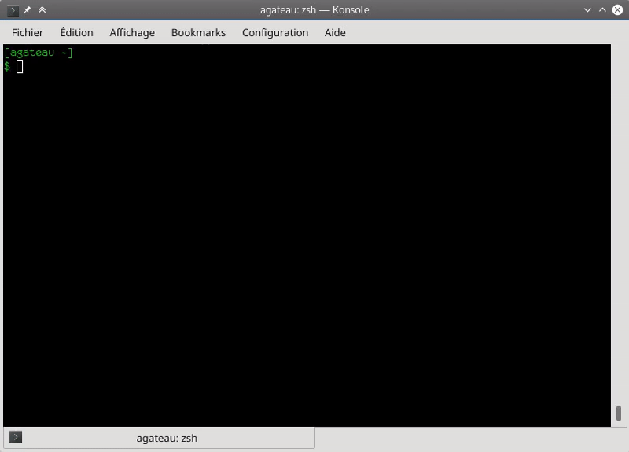

# CMakeDoc

## What is it?

CMakeDoc is a command-line tool to read CMake documentation. It lets you
search through CMake commands, modules, variables and properties before
displaying the selected topic with `less` or the pager defined in `$PAGER`.

## Demo

## Dependencies

- `cmake` (obviously). Must be in `$PATH`.
- `less`, or a pager defined in `$PAGER`.

## Installation

Using pip:

    pip install cmakedoc

Manually:

    ./setup.py install
